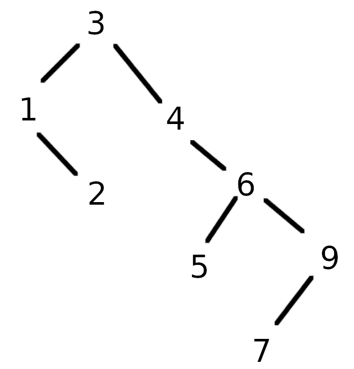
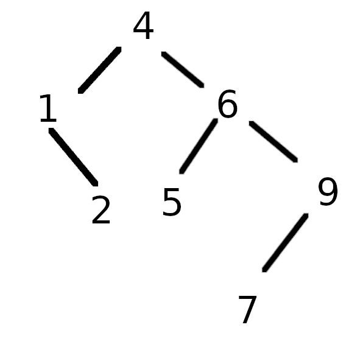

# Data Structures and Algorithm Analysis in C++

Mark Allen Weiss

## Chapter 2

### 2.6

a) 2^ (2^(N-1))
b) 

### 2.7

| Code # | Big-Oh | N=10 | N =100  | N = 1000 |
| ------ | ------ | ---- | ------- | -------- |
| 1      | O(N)   | 1us  | 10us    | 114us    |
| 2      | O(N^2) | 20us | 1008us  | 43764us  |
| 3      | O(N^3) | 93us | 49.9 ms | 34.84s   |
| 4      | O(N^2) | 6us  | 227us   | 15295us  |

| Code # | Big-Oh | N=10 | N =20 | N = 40 |
| ------ | ------ | ---- | ----- | ------ |
| 5      | O(N^5) | 1ms  | 16ms  | 266ms  |
| 6      | O(N^4) | 3us  | 0.2ms | 1.9ms  |

### 2.9

| Input         | 1              | 2        | 3          | 4        |
| ------------- | -------------- | -------- | ---------- | -------- |
| Size          | O(N^3)         | O(N^2)   | O(N log N) | O(N)     |
| N = 100       | 0.000159       | 0.000006 | 0.000005   | 0.000002 |
| N = 1,000     | 0.095857       | 0.000371 | 0.000060   | 0.000022 |
| N = 10,000    | 86.67          | 0.033322 | 0.000619   | 0.000222 |
| N = 100,000   | **86670**      | 3.33     | 0.006700   | 0.002205 |
| N = 1,000,000 | **86670x10^5** | **333**  | 0.074870   | 0.022711 |

### 2.10

a) Sum each of the N digits one by one: **O(N)**
b) Repeatedly sum each of the N digits(N times): **O(n^2)**
c) Same as multiply, but using subtraction instead of sum: **O(n^2)**

### 2.11

a)2.5ms
b)3.375 ms
c)12.5 ms
d)62.5 ms

### 2.12

a) 12000000
b) 
c) 34641
d) 4932

## Chapter 3

### 3.1

```c++
#include <list>
#include <vector>
#include <iostream>
#include <time.h>
using namespace std;

typedef std::list<int> list_of_int;
// typedef std::vector<int> list_of_int;

void printLots(const list_of_int& L, const list_of_int& P){
    int count =0;
    for(list_of_int::const_iterator i = L.begin(), j= P.begin(); i!= L.end(); ++i, ++count){
        if(count == *j){
            cout << *i << ", ";
            ++j;
        }
    }
}

int main(){
    int start_s = clock();
    list_of_int L = {100, 200, 300, 400, 500, 600, 700, 800, 900, 1000};
    list_of_int P = {1, 3, 4, 6};

    printLots(L,P);

    int stop_s = clock();

    cout << "\n Running time: " << (stop_s - start_s) / double(CLOCKS_PER_SEC) *1000 << "\n";
    return 0;
}
```

Ouputs:

```
// Using Vector:
200, 400, 500, 700,
Running time: 0.049
// Using List:
200, 400, 500, 700,
Running time: 0.062
```

If it uses a vector implementations it will be O(n), if it is a linked list, O(n^2).

### 3.11

```c++
#include <bits/stdc++.h>
using namespace std;

struct Node {
    int data;
    Node* next;
};

class List {
    private:

    int size;

    public:
    Node* root;

    List();                         // Constructor
    void insert(int value);         // Prototypes
    void remove_at(int index);
    void remove(int value);
    void printAll();
    int listSize();
    bool has(int value);
};

List::List(){
    root = new Node;
    root->data = 0;
    root->next = new Node;
    size = 0;
}

void List::printAll(){
    Node* lastNode = root;
    lastNode = lastNode->next;
    for(int i =0; i < size; i++){
        cout << lastNode->data << " ";
        lastNode = lastNode->next;
    }
    cout << "\n";
}

bool List::has(int value){
    Node* lastNode = root;
    for(int i=0; i<=size; i++){
        if(lastNode->data == value){
            return true;
        }
        lastNode = lastNode->next;
    }
    return false;
}

void List::insert(int value){
    Node* lastNode = root;
    for(int i=0; i<=size; i++){
        lastNode = lastNode->next;
    }
    if(has(value) == true){
        cout << "Element " << value << " already in the list" << "\n";
    }else{
    lastNode->data = value;
    lastNode->next = new Node;
    size++;
    }
}

int List::listSize(){
    return size;
}

void List::remove(int value){
    Node* lastNode = root;
    for(int i=0; i<=size; i++){
        Node* temp = lastNode;
        lastNode = lastNode->next;
        if(lastNode->data == value){
            temp->next = lastNode->next;
            size--;
            break;
        }
    }
}

int main(){

    List head = List();

    head.insert(2);
    head.insert(3);
    head.insert(3);
    head.insert(4);
    head.printAll();

    cout << "Size: " << head.listSize() << "\n";
    cout << "Has 3: " << head.has(3) << "\n";
    cout << "Has 5: " << head.has(5) << "\n\n";

    cout << "Remove 3 " << "\n\n";
    head.remove(3);

    head.printAll();
    cout << "Has 3: " << head.has(3) << "\n";
    cout << "Size: " << head.listSize() << "\n";

    return 0;

}
```

Output:

```
Element 3 already in the list
2 3 4
Size: 3
Has 3: 1
Has 5: 0

Remove 3

2 4
Has 3: 0
Size: 2
```

### 3.12

Just change the `insert()` prototype:

```c++
void List::insert(int value){
    Node* lastNode = root;
    for(int i=0; i<=size; i++){
        if(lastNode->data == value){
            cout << "Element " << value << " already in the list" << "\n";
        }else{
            Node* next = lastNode->next;
            if (next->data > value){
                Node* newNode = new Node;
                newNode->data = value;
                newNode->next = next;
                lastNode->next = newNode;
                size++;
                break;
            }else{
                lastNode = lastNode->next;
            }
        }
    }
}
```

## Chapter 4

### 4.1

a. Node `A`.
b. Nodes `G`, `H`, `I`, `L`, `M`, `K`.

### 4.2

| Node | Parent | Children | Siblings | Depth | Height |
| ---- | ------ | -------- | -------- | ----- | ------ |
| `A`  | -      | `B`, `C` | -        | 0     | 4      |
| `B`  | `A`    | `D`, `E` | `C`      | 1     | 3      |
| `C`  | `A`    | `F`      | `B`      | 1     | 2      |
| `D`  | `B`    | `G`,`H`  | `E`      | 2     | 1      |
| `E`  | `B`    | `I`,`J`  | 2        | 2     | 2      |
| `F`  | `C`    | `K`      | -        | 2     | 1      |
| `G`  | `D`    | -        | `H`      | 3     | 0      |
| `H`  | `D`    | -        | `G`      | 3     | 0      |
| `I`  | `E`    | -        | `J`      | 3     | 0      |
| `J`  | `E`    | `L`, `M` | `I`      | 3     | 0      |
| `K`  | `F`    | -        | -        | 3     | 0      |
| `L`  | `J`    | -        | `M`      | 4     | 0      |
| `M`  | `J`    | -        | `L`      | 4     | 0      |

### 4.3

4

### 4.4

There are N nodes, each of them have 2 pointers for their children totalizing 2N pointers. Except for the root, each node will also have one incoming pointer, totalizing N-1 poiters used. Therefore, there will be N+1 `nullptr`.

### 4.8

Prefix : - \* _ a b + c d e
Infix: (a _ b _ (c + d)) - e
Postfix: a b _ c d + \* e -

### 4.9

a.Insertion:



a.After remove the root:


