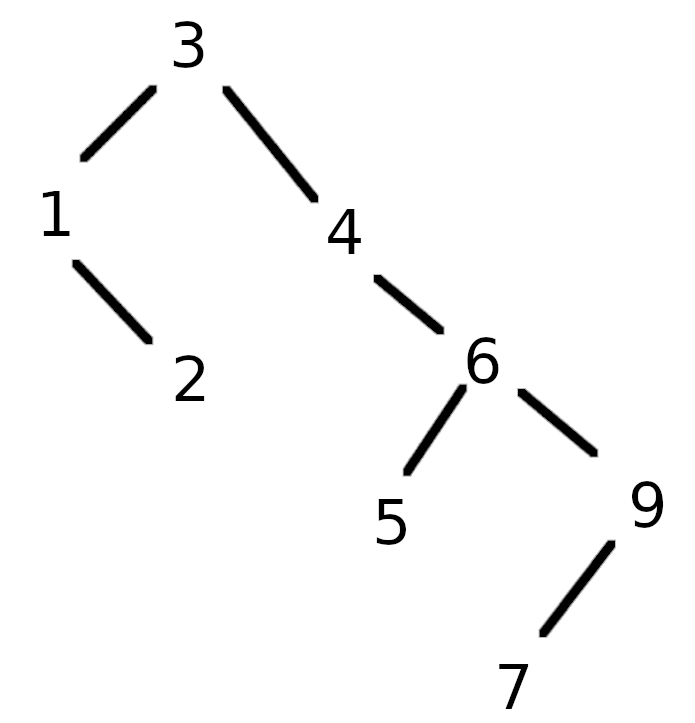
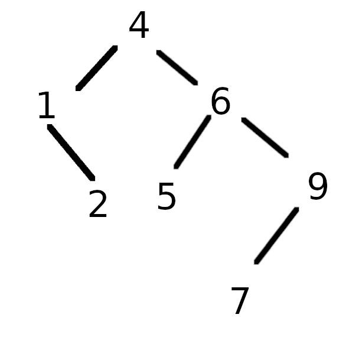

# Chapter 4

#### 4.1

a. Node `A`.
b. Nodes `G`, `H`, `I`, `L`, `M`, `K`.

#### 4.2

| Node | Parent | Children | Siblings | Depth | Height |
| ---- | ------ | -------- | -------- | ----- | ------ |
| `A`  | -      | `B`, `C` | -        | 0     | 4      |
| `B`  | `A`    | `D`, `E` | `C`      | 1     | 3      |
| `C`  | `A`    | `F`      | `B`      | 1     | 2      |
| `D`  | `B`    | `G`,`H`  | `E`      | 2     | 1      |
| `E`  | `B`    | `I`,`J`  | 2        | 2     | 2      |
| `F`  | `C`    | `K`      | -        | 2     | 1      |
| `G`  | `D`    | -        | `H`      | 3     | 0      |
| `H`  | `D`    | -        | `G`      | 3     | 0      |
| `I`  | `E`    | -        | `J`      | 3     | 0      |
| `J`  | `E`    | `L`, `M` | `I`      | 3     | 0      |
| `K`  | `F`    | -        | -        | 3     | 0      |
| `L`  | `J`    | -        | `M`      | 4     | 0      |
| `M`  | `J`    | -        | `L`      | 4     | 0      |

#### 4.3
4

#### 4.4

There are N nodes, each of them have 2 pointers for their children totalizing 2N pointers. Except for the root, each node will also have one incoming pointer, totalizing N-1 poiters used. Therefore, there will be N+1 `nullptr`.

#### 4.8

Prefix : - \* _ a b + c d e
Infix: (a _ b _ (c + d)) - e
Postfix: a b _ c d + \* e -

#### 4.9

a.Insertion:

a.After remove the root:

