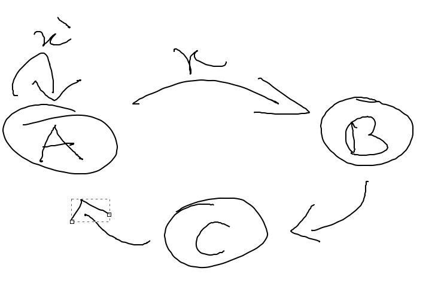

# Chapter 3

#### 3.1
(a) 0.02 ms
(b) 3.33 ns 
(c) 0.29 ns
(d) 0.1 ns
(e) 1 ps

#### 3.2
(a) 0.3 ns
(b) 0.1 ns
(c) 1.5 ns
(d) 0.66 ns

#### 3.3
(a) 1 Hz
(b) 1 KHz
(c) 50 MHz
(d) 1 GHz
(e) 0.66 THz

####  3.4
(a) 2 Hz
(b) 2.5 MHz
(c) 0.25 GHz
(d) 50 GHz

> For the next questions: Markdown isn't great to represent timing diagrams, but I did my best to make it as clear as possible. They was made based on **GitHub**'s Markdown rendering, so it will better understandable **AFTER** rendering.  

#### 3.5

S____|‾‾‾‾‾‾‾‾‾‾‾|______  
R__________________  
t ‾‾‾‾‾‾‾‾‾|____________  
Q______|‾‾‾‾‾‾‾‾‾‾‾‾‾‾‾‾‾‾‾  

#### 3.6

S____|‾|_____________  
R__________________  
t ‾‾‾‾‾‾‾‾‾|_ |‾‾‾‾‾‾‾‾‾‾‾‾‾‾‾‾‾  
Q__________________  

#### 3.7

C____|‾‾‾‾‾‾‾‾‾‾‾‾|_______ |‾‾‾‾‾‾‾‾‾‾‾‾|___  
S__|‾‾‾‾‾‾‾|________________________  
R_________|‾‾|____________ |‾‾|_______  
S1_____|‾‾‾|________________________   
R1_________|‾‾|____________ |‾‾|_____   
Q________|‾‾‾‾|____________________  

#### 3.8

C______|‾‾‾‾‾‾‾‾‾‾‾‾|_______ |‾‾‾‾‾‾‾‾‾‾‾‾|_______ |‾‾‾‾‾‾‾‾‾‾‾‾|___  
S__|‾‾‾|___________________ |‾‾‾‾|________________ |‾‾‾‾‾‾|___  
R__________|‾‾‾|___________________________ |‾‾|_______  
S1_________________________|‾‾‾‾|________________ |‾‾‾‾‾‾|__  
R1__________|‾‾‾|___________________________ |‾‾|_____  
Q___________________________|‾‾‾‾‾‾‾‾‾‾‾‾‾‾‾‾‾‾‾‾‾‾‾‾‾|____ |‾‾‾‾‾‾‾‾  

#### 3.9

C______|‾‾‾‾‾‾‾‾‾‾‾‾|_______ |‾‾‾‾‾‾‾‾‾‾‾‾|_______ |‾‾‾‾‾‾‾‾‾‾‾‾|___  
S________________ |‾‾‾‾|___________________ |‾‾‾‾‾‾|_____  
R__________|‾‾‾|____________________________ |‾‾‾‾|_______  
S1_______________________________________ |‾‾‾‾‾‾|____  
R1__________|‾‾‾|____________________________ |‾‾‾‾|_____  
Q_________________________________________|‾‾|_ |‾|_ |‾|_ |‾|_ |‾|_*unstable*...  

#### 3.10

C____|‾‾‾‾‾‾‾‾‾‾‾‾|_______ |‾‾‾‾‾‾‾‾‾‾‾‾|___  
D__|‾‾‾‾‾‾‾|________________ |‾‾‾‾|_______  
S__|‾‾‾‾‾‾‾|________________ |‾‾‾‾|_______  
R‾‾‾‾|___ |‾‾‾‾‾‾‾‾‾‾‾‾‾‾‾‾‾‾‾‾‾‾‾‾‾‾‾‾|__ |‾‾‾‾‾‾‾‾‾‾‾‾  
*S1* ___ |‾‾‾‾|________________ |‾‾‾‾|_______  
*R1* _______|‾‾‾‾‾‾‾| ________|‾‾‾‾| __________   
Q _____|‾‾‾‾‾| _______________|‾‾‾‾‾‾‾| _____  

#### 3.11

C______|‾‾‾‾‾‾‾‾‾‾‾‾|_______ |‾‾‾‾‾‾‾‾‾‾‾‾|_______ |‾‾‾‾‾‾‾‾‾‾‾‾|___  
D________|‾‾‾‾‾‾|___________________ |‾‾‾‾|_______  
S________|‾‾‾‾‾‾|___________________ |‾‾‾‾|_______  
R‾‾‾‾‾‾‾‾‾‾‾‾‾‾|___ |‾‾‾‾‾‾‾‾‾‾‾‾‾‾‾‾‾‾‾‾‾‾‾‾‾‾‾‾‾‾‾‾|__ |‾‾‾‾‾‾‾‾‾‾‾‾  
*S1* _______ |‾‾‾‾‾|_______________________________  
*R1* ____|‾‾‾‾| ___|‾| ________ |‾‾‾‾‾‾‾‾‾‾‾‾| _______|‾‾‾‾‾‾‾‾‾‾‾| ___   
Q _________|‾‾‾‾‾| ___________________________________  

#### 3.12

C________|‾‾‾‾‾‾‾‾‾‾‾‾|_______ |‾‾‾‾‾‾‾‾‾‾‾‾|___  
D/Dm__|‾‾‾‾‾‾‾|________________ |‾‾‾‾|_______  
Cm‾‾‾‾‾‾‾‾‾‾‾‾|_______ |‾‾‾‾‾‾‾‾‾‾‾|_______ |‾‾‾‾‾‾  
Qm/Ds__|‾‾‾‾‾‾‾‾‾‾‾‾‾‾‾‾‾‾|___________________  
Cs_______|‾‾‾‾‾‾‾‾‾‾‾‾|_______ |‾‾‾‾‾‾‾‾‾‾‾‾|___  
Qs________|‾‾‾‾‾‾‾‾‾‾‾‾‾‾‾‾‾‾‾‾‾‾‾‾‾|____________  

#### 3.13

C______|‾‾‾‾‾‾‾‾‾‾‾‾|_______ |‾‾‾‾‾‾‾‾‾‾‾‾|_______ |‾‾‾‾‾‾‾‾‾‾‾‾|___  
D/Dm____|‾‾‾‾‾‾‾|___________________ |‾‾‾‾|_______  
Cm‾‾‾‾‾‾‾‾‾|______ |‾‾‾‾‾‾‾‾‾‾‾‾‾|_______ |‾‾‾‾‾‾‾‾‾‾‾‾|_______ |‾‾‾‾‾‾  
Qm/Ds____________________________|‾‾‾‾|_____________  
Cs_____|‾‾‾‾‾‾‾‾‾‾‾‾|_______ |‾‾‾‾‾‾‾‾‾‾‾‾|_______ |‾‾‾‾‾‾‾‾‾‾‾‾|___  
Qs________________________________________________  

#### 3.14

C______|‾‾‾‾‾‾‾‾‾‾‾‾|_______ |‾‾‾‾‾‾‾‾‾‾‾‾|_______ |‾‾‾‾‾‾‾‾‾‾‾‾|___  
D____|‾‾‾‾‾|_ |‾‾‾‾|___________ |‾‾‾‾‾‾‾‾‾‾‾‾‾‾‾‾‾‾‾‾‾‾‾‾‾|_______  
Ql______|‾‾|__ |‾‾‾‾|___________ |‾‾‾‾‾‾‾‾‾‾‾‾‾‾‾‾‾‾‾‾‾‾‾‾‾|______  
Qff______|‾‾‾‾‾‾‾‾‾‾‾‾‾‾‾‾‾‾‾‾‾‾‾‾‾|________________|‾‾‾‾‾‾‾‾‾‾‾‾‾‾‾  

The latch is a case sensitive device. The flip-flop is edge triggered. 

#### 3.15

C______|‾‾‾‾‾‾‾‾‾‾‾‾|_______ |‾‾‾‾‾‾‾‾‾‾‾‾|_______ |‾‾‾‾‾‾‾‾‾‾‾‾|_______ |‾‾‾‾‾‾‾‾‾‾‾‾|___  
D____________|‾‾‾‾‾|________ |‾‾‾‾|_______ |‾‾‾‾‾‾‾‾‾‾‾‾‾‾‾‾‾‾‾‾‾‾‾‾‾‾‾‾‾|_______  
Ql____________|‾‾‾‾‾‾‾‾‾‾‾‾‾‾‾‾|__ |‾‾‾‾|_________ |‾‾‾‾‾‾‾‾‾‾‾‾‾‾‾‾‾‾‾‾‾‾‾‾‾|__________  
Qff_____________________________________|‾‾‾‾‾‾‾‾‾‾‾‾‾‾‾‾‾‾‾‾‾‾‾‾‾‾‾‾‾‾‾‾‾‾‾‾‾‾‾‾  

The latch is a case sensitive device. The flip-flop is edge triggered. 

#### 3.16 to 3.19

There is no way to draw those circuits on markdown. So those will be skipped. 

#### 3.20

| a3..a0 | 11  | 14  | 8   | 1   | 5   | 9   | 15  | 15  | 3   | 3   | 9   | 14  | 0   | 0   | 0   | 7   | 2   | 7   |
| ------ | --- | --- | --- | --- | --- | --- | --- | --- | --- | --- | --- | --- | --- | --- | --- | --- | --- | --- |
| C      |     | X   |     |     | X   |     | X   |     |     |     | X   |     |     | X   |     |     | X   |     |
| b3..b0 |     |     | 14  | 14  | 14  | 5   | 5   | 15  | 15  | 15  | 15  | 9   | 9   | 9   | 0   | 0   | 0   | 2   |
| c3..c0 |     |     |     | 14  | 14  | 14  | 5   | 5   | 15  | 15  | 15  | 15  | 9   | 9   | 9   | 0   | 0   | 0   |
| d3..d0 |     |     |     | 14  | 14  | 14  | 5   | 5   | 15  | 15  | 15  | 15  | 9   | 9   | 9   | 0   | 0   | 0   |

#### 3.21

| a3..a0 | 11  | 14  | 8   | 1   | 5   | 9   | 15  | 15  | 3   | 3   | 9   | 14  | 0   | 0   | 0   | 7   | 2   | 7   |
| ------ | --- | --- | --- | --- | --- | --- | --- | --- | --- | --- | --- | --- | --- | --- | --- | --- | --- | --- |
| C      |     | X   |     |     | X   |     | X   |     |     |     | X   |     |     | X   |     |     | X   |     |
| b3..b0 |     |     | 14  | 14  | 14  | 5   | 5   | 15  | 15  | 15  | 15  | 9   | 9   | 9   | 0   | 0   | 0   | 2   |
| c3..c0 |     |     |     | 14  | 14  | 14  | 5   | 5   | 15  | 15  | 15  | 15  | 9   | 9   | 9   | 0   | 0   | 0   |
| d3..d0 |     |     |     |     | 14  | 14  | 14  | 5   | 5   | 15  | 15  | 15  | 15  | 9   | 9   | 9   | 0   | 0   |

#### 3.22

Ck___|‾‾‾‾‾‾|____ |‾‾‾‾‾‾|____ |‾‾‾‾‾‾|____ |‾‾‾‾‾‾|____ |‾‾‾‾‾‾|____ |‾‾‾‾‾‾|____ |‾‾‾‾‾‾|____  
Call____|‾‾‾‾‾‾‾‾‾‾‾‾‾‾‾‾‾‾|______________________________ |‾‾‾‾‾‾‾‾‾‾‾‾‾‾‾‾‾‾‾‾‾|______  
Cncl__________________________ |‾‾‾‾‾‾‾‾‾‾|____________ |‾‾‾‾‾‾‾‾‾‾‾‾‾‾‾‾‾‾‾‾|_______  
L ________|‾‾‾‾‾‾‾‾‾‾‾‾‾‾‾‾‾‾‾‾‾‾‾‾‾‾‾‾‾‾‾‾‾‾‾‾‾‾‾| ________________|‾‾‾‾‾‾‾‾‾‾‾‾‾‾‾‾‾‾‾‾‾‾‾‾‾‾‾‾‾‾‾  


#### 3.23

Ck___|‾‾‾‾‾‾|____ |‾‾‾‾‾‾|____ |‾‾‾‾‾‾|____ |‾‾‾‾‾‾|____ |‾‾‾‾‾‾|____ |‾‾‾‾‾‾|____ |‾‾‾‾‾‾|____  
R______|‾‾|_______________________________________________ |‾‾‾‾‾‾‾‾‾‾‾‾|_____  
G____________________________|‾‾‾‾‾|____________________________________  
B______________________________________________|‾‾‾‾|___________________  
A______|‾‾‾‾‾‾‾‾‾‾‾‾‾|______________ |‾‾‾‾‾‾‾‾‾‾‾‾‾‾|________|‾‾‾‾‾‾‾‾‾‾‾‾‾‾‾‾‾‾‾‾‾‾‾‾‾‾‾‾‾‾‾‾‾‾‾‾  
R1 _____ |‾‾‾‾‾‾‾‾‾‾‾‾‾‾‾‾‾‾‾‾‾‾‾‾‾‾‾‾‾‾‾‾‾‾‾‾‾‾‾‾‾‾‾‾‾‾‾‾‾‾‾‾‾‾‾‾‾‾‾‾‾‾‾‾‾‾| __________________  
Bo _______________________________________________|‾‾‾‾‾‾‾‾‾‾‾‾‾‾‾‾‾‾‾‾‾‾‾‾‾‾‾‾‾‾‾  
Go __________________________________________________________________  
R2 __________________________________________________________________  
Out __________________________________________________________________  

#### 3.24



#### 3.25


#### 3.26


#### 3.27


#### 3.28


#### 3.29


#### 3.30


#### 3.31

gcnt ‾‾‾‾‾‾‾‾‾|______ |‾‾‾‾‾‾‾‾‾‾‾‾‾‾‾‾‾‾‾‾‾‾‾‾‾‾‾‾‾‾‾‾‾‾‾‾‾‾‾‾‾‾‾‾‾‾‾‾‾‾‾‾‾‾‾  
C‾‾|_ |‾‾|_ |‾‾|_ |‾‾|_ |‾‾|_ |‾‾|_ |‾‾|_ |‾‾|_ |‾‾|_ |‾‾|_ |‾‾|_ |‾‾|_ |‾‾|_  
y____|‾‾‾‾‾‾‾‾‾‾‾‾|______ |‾‾‾‾‾‾‾‾‾‾‾‾|______ |‾‾‾‾‾‾‾‾‾‾‾‾|_______  
x_______________|‾‾‾‾‾‾‾‾‾‾‾‾‾‾‾‾‾‾‾‾‾‾‾‾|______________ |‾‾‾‾  
z________|‾‾‾‾‾‾‾‾‾‾‾‾‾‾‾‾‾‾‾‾‾‾‾|______________ |‾‾‾‾‾‾‾‾‾‾‾‾‾‾‾‾‾  


#### 3.32

C_|‾‾|_ |‾‾|_ |‾‾|_ |‾‾|_ |‾‾|_ |‾‾|_ |‾‾|_ |‾‾|_ |‾‾|_ |‾‾|_  
s___|‾‾‾‾‾‾|____________________________  
r___________|‾‾‾‾‾‾‾‾‾‾‾|___ |‾‾‾‾|___________  
a______|‾‾‾‾‾|__________________________  
e________________________|‾‾‾‾‾‾‾|______  

#### 3.332

(a) 2
(b) 3
(c) 4
(d) 5
(e) 10

#### 3.34

65536

#### 3.35


| # States | # Transitions |
| -------- | ------------- |
| 1        | 0             |
| 2        | 2             |
| 3        | 6             |
| 4        | 12            |
| 5        | 20            |
| 6        | 30            |

It'll have `N*(N-1)` possible transitions. 

#### 3.39

| State | s0  | s1  | a   |     | n0  | n1  | y   |
| ----- | --- | --- | --- | --- | --- | --- | --- |
| A     | 0   | 0   | 0   |     | 0   | 1   | 0   |
| A     | 0   | 0   | 1   |     | 0   | 0   | 0   |
| B     | 0   | 1   | 0   |     | 0   | 1   | 1   |
| B     | 0   | 1   | 1   |     | 1   | 0   | 1   |
| C     | 1   | 0   | 0   |     | 1   | 1   | 1   |
| C     | 1   | 0   | 1   |     | 1   | 1   | 1   |
| D     | 1   | 1   | 0   |     | 0   | 0   | 1   |
| D     | 1   | 1   | 1   |     | 0   | 0   | 1   |

From that, we have: 
```
y = s1 + s0
n0 = s0's1a + s0s1'
n1 =  s0'a' + s0's1
```
Circuit diagram:


#### 3.40

| State | s0  | s1  | a   | b   |    | n0  | n1  | y   |
| ----- | --- | --- | --- | --- |--- | --- | --- | --- |
| A     | 0   | 0   | 0   | 0   |    | 0   | 1   | 0   |
| A     | 0   | 0   | 0   | 1   |    | 1   | 0   | 0   |
| A     | 0   | 0   | 1   | x   |    | 0   | 0   | 0   |
| B     | 0   | 1   | 0   | x   |    | 0   | 1   | 1   |
| B     | 0   | 1   | 1   | x   |    | 1   | 0   | 1   |
| C     | 1   | 0   | x   | 0   |    | 1   | 0   | 1   |
| C     | 1   | 0   | x   | 1   |    | 1   | 1   | 1   |
| D     | 1   | 1   | x   | x   |    | 0   | 0   | 0   |

From that, we have: 
```
y = s0's1 + s0s1'
n0 = s0's1'a'b + s0's1a + s0s1'
n1 =  s0's1'a'b' + s0's1a' + s0s1'b
```
Circuit diagram:
