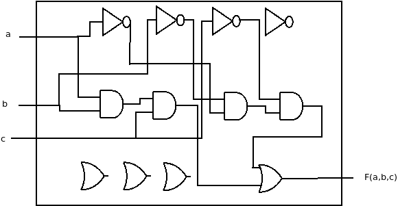

# Chapter 7

#### 7.1

While full-custom ICs require a lot of time to have their layout design created before production. Gate arrays IC are chips whose transistors are predesigned, meaning that only the wires remain to be fabricated. This shortens the production time since only the very last steps of fabrication are made.

#### 7.2

Because gate arrays implemented using NAND/NOR gates are more efficient than those implemented using AND/OR/NOT. Also, the NAND gate is a universal gate, which means any boolean circuit can be implemented using only it.

#### 7.3

I'm jumping some question, my major interest in this chapter are FPGAs. 

#### 7.18

Truth Table:
| a   | b   | c   | F(a,b,c) |
| --- | --- | --- | -------- |
| 0   | 0   | 0   | 0        |
| 0   | 0   | 1   | 0        |
| 0   | 1   | 0   | 0        |
| 0   | 1   | 1   | 1        |
| 1   | 0   | 0   | 1        |
| 1   | 0   | 1   | 1        |
| 1   | 1   | 0   | 1        |
| 1   | 1   | 1   | 1        |

The implementation is a simple single access to the memory array containing the outputs in the truth table. 

#### 7.19

**LUP1** --> inputs: a b | output: t
**LUP2** --> inputs: c,d,t | output: F(a,b,c,d)
|LUP1||LUP2|
|-|-|-|
|0||0|
|0||0|
|0||0|
|1||1|

#### 7.20