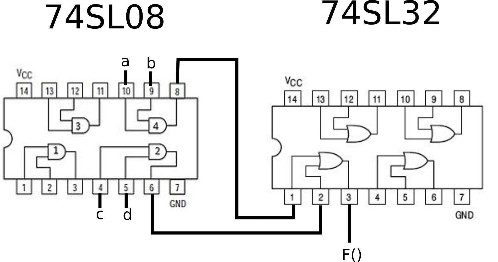
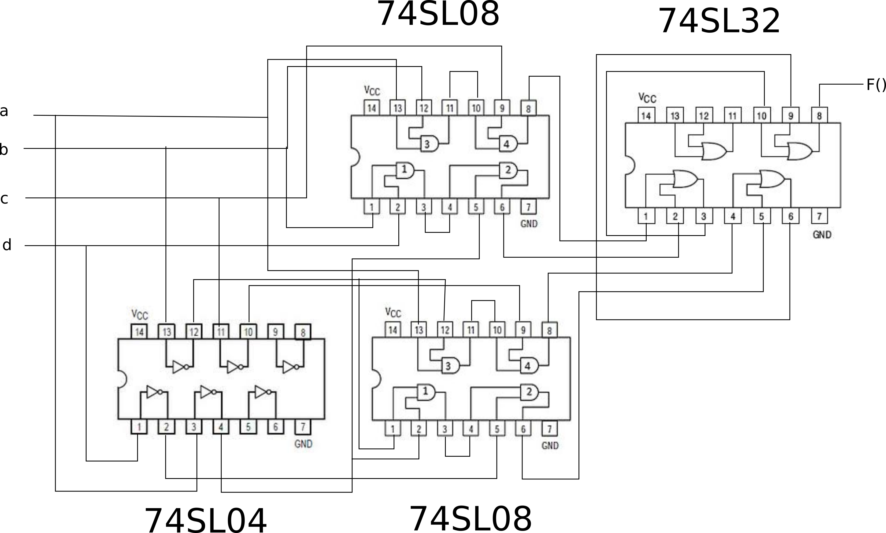

# Chapter 7

#### 7.1

While full-custom ICs require a lot of time to have their layout design created before production. Gate arrays IC are chips whose transistors are predesigned, meaning that only the wires remain to be fabricated. This shortens the production time since only the very last steps of fabrication are made.

#### 7.2

Because gate arrays implemented using NAND/NOR gates are more efficient than those implemented using AND/OR/NOT. Also, the NAND gate is a universal gate, which means any boolean circuit can be implemented using only it.

#### 7.3


I'm jumping some question, my major interest in this chapter are FPGAs.

#### 7.18

Truth Table:
| a | b | c | F(a,b,c) |
| --- | --- | --- | -------- |
| 0 | 0 | 0 | 0 |
| 0 | 0 | 1 | 0 |
| 0 | 1 | 0 | 0 |
| 0 | 1 | 1 | 1 |
| 1 | 0 | 0 | 1 |
| 1 | 0 | 1 | 1 |
| 1 | 1 | 0 | 1 |
| 1 | 1 | 1 | 1 |

The implementation is a simple single access to the memory array containing the outputs in the truth table.

> To avoid drawing in Markdown, the following description will be used to describe all LUP inputs and outputs, followed by a table with the LUP itself (This format will be used for the next questions too):

**LUP1 d1** --> implementing: `a+bc`| inputs: a b c | output: F

| LUP1 |
| ---- |
| 0    |
| 0    |
| 0    |
| 1    |
| 1    |
| 1    |
| 1    |
| 1    |

**LUP1 d1** --> implementing: `ab*1`| inputs: a b 1 | output: d1

#### 7.19

**LUP1 d1** --> implementing: `ab*1`| inputs: a b 1 | output: LUP1d1
**LUP1 d0** --> Not used.
**LUP2 d1** --> implementing: `LUP1d1 + cd`| inputs: a b d1 | output: LUP2d1 (`F()`)
**LUP2 d0** --> Not used.

| LUP1 d1 | LUP1 d0 |     | LUP2 d1 | LUP2 d0 |
| ------- | ------- | --- | ------- | ------- |
| 0       | _0_     |     | 0       | _0_     |
| 0       | _0_     |     | 0       | _0_     |
| 0       | _0_     |     | 0       | _0_     |
| 1       | _0_     |     | 1       | _0_     |
| 0       | _0_     |     | 1       | _0_     |
| 0       | _0_     |     | 1       | _0_     |
| 0       | _0_     |     | 1       | _0_     |
| 1       | _0_     |     | 1       | _0_     |

#### 7.20

```
F(a,b,c,d) = a'bd + b'cd'
F(a,b,c,d) = a'bd + (b'd' * c)
```

**LUP1 d1** --> implementing: `a'bd`| inputs: a b d | output: d1
**LUP1 d0** --> implementing: `b'd'`| inputs: a b | output: d0
**LUP2 d1** --> implementing: `d1 + (d0c)` | inputs: d1, d0, c | output: d1 (F)
**LUP2 d0** --> Not used.

| LUP1 d1 | LUP1 d0 |     | LUP2 d1 | LUP2 d0 |
| ------- | ------- | --- | ------- | ------- |
| 0       | 1       |     | 0       | _0_     |
| 0       | 0       |     | 0       | _0_     |
| 0       | 0       |     | 0       | _0_     |
| 1       | 0       |     | 1       | _0_     |
| 0       | 1       |     | 1       | _0_     |
| 0       | 0       |     | 1       | _0_     |
| 0       | 0       |     | 1       | _0_     |
| 0       | 0       |     | 1       | _0_     |

#### 7.21

```
F(x,y,z) = x'y + xyz'
G(w,x,y,z) = w'x'y + w'xyz'
G(w,x,y,z) = w' (x'y + xyz')
```

**LUP1 d1** --> implementing: `x'y'`| inputs: w y z | output: d1
**LUP1 d0** --> implementing: `xyz'`| inputs: a b | output: d0
**LUP2 d1** --> implementing: `(d1 + d0)` | inputs: d1, d0, w | output: d1 (F)
**LUP2 d0** --> implementing: `w' (d1 + d0)` | inputs: d1, d0, c | output: d1 (G)

| LUP1 d1 | LUP1 d0 |     | LUP2 d1 | LUP2 d0 |
| ------- | ------- | --- | ------- | ------- |
| 0       | 0       |     | 0       | 0       |
| 0       | 0       |     | 0       | 0       |
| 1       | 0       |     | 1       | 1       |
| 1       | 0       |     | 1       | 0       |
| 0       | 0       |     | 1       | 1       |
| 0       | 0       |     | 1       | 0       |
| 0       | 1       |     | 1       | 1       |
| 0       | 1       |     | 1       | 0       |

#### 7.22

**LUP1 d1** --> implementing: `abc` | inputs: a b c | output: d1
**LUP1 d0** --> implementing: `a'` | inputs: a b c | output: d0 (G)
**LUP2 d1** --> implementing: `d1 + d` | inputs: d1, d0, d | output: d1 (F)
**LUP2 d0** --> Not used.

| LUP1 d1 | LUP1 d0 |     | LUP2 d1 | LUP2 d0 |
| ------- | ------- | --- | ------- | ------- |
| 0       | 1       |     | 0       | _0_     |
| 0       | 1       |     | 1       | _0_     |
| 0       | 1       |     | 0       | _0_     |
| 0       | 1       |     | 1       | _0_     |
| 0       | 0       |     | 1       | _0_     |
| 0       | 0       |     | 1       | _0_     |
| 0       | 0       |     | 1       | _0_     |
| 1       | 0       |     | 1       | _0_     |

#### 7.23

```
  a1    b1                      a1    b1
  |     |                       |     |
  V     V                       V     V
 _____________                ____________
|           Gt|---- InGt --> |            |---> OutGt
|           Eq|---- InEq --> |            |---> OutEq
|           Lt|---- InLt --> |            |---> OutLt
 ‾‾‾‾‾‾‾‾‾‾‾‾‾                ‾‾‾‾‾‾‾‾‾‾‾‾
```

```
InGt = a1 *  b1'
InLt = a1' * b1
InEq = a1 XNOR b1
OutGt = InGt + (InEq * a0 * b0')
OutLt = InLt + (InEq * a0' * b0)
OutEq = InEq * ( a0 XNOR b0)
```

**LUP1 d1** --> implementing: `a1 * b1'` | inputs: a1 b1 0 | output: LUP1d1 (`InGt`)
**LUP1 d0** --> implementing: `a1' * b1` | inputs: a1 b1 0 | output: LUP1d0 (`InLt`)

**LUP2 d1** --> implementing: `a1 XNOR b1` | inputs: a1 b1 0 | output: LUP2d1(`InEq`)
**LUP2 d0** --> Not used.

**LUP3 d1** --> implementing: `InEq * a0 * b0'` | inputs: a0 b0 LUP2d1(`InEq`) | output: LUP2d1 (`x`)
**LUP3 d0** --> implementing: `InEq * a0' * b0` | inputs: a0 b0 LUP2d1(`InEq`) | output: LUP2d0 (`y`)

**LUP4 d1** --> implementing: `InGt + x` | inputs: LUP1d1 LUP2d1 0 | output: LUP4d1 (`OutGt`)
**LUP5 d1** --> implementing: `InLt + y` | inputs: LUP1d0 LUP2d0 0 | output: LUP5d1 (`OutLt`)
**LUP6 d1** --> implementing: `InEq * ( a0 XNOR b0)` | inputs: LUP2d1 a0 b0 | output: LUP6d1 (`OutEq`)

| LUP1 d1 | LUP1 d0 |     | LUP2 d1 | LUP2 d0 |
| ------- | ------- | --- | ------- | ------- |
| 0       | 0       |     | 1       | _0_     |
| 0       | 1       |     | 0       | _0_     |
| 0       | 0       |     | 0       | _0_     |
| 1       | 0       |     | 1       | _0_     |
| _0_     | _0_     |     | _1_     | _0_     |
| _0_     | _1_     |     | _0_     | _0_     |
| _0_     | _0_     |     | _0_     | _0_     |
| _1_     | _0_     |     | _1_     | _0_     |

| LUP3 d1 | LUP3 d0 |     | LUP4 d1 |     | LUP5d1 |     | LUP6d1 |
| ------- | ------- | --- | ------- | --- | ------ | --- | ------ |
| 0       | 0       |     | 0       |     | 0      |     | 0      |
| 0       | 0       |     | 1       |     | 1      |     | 0      |
| 0       | 0       |     | 1       |     | 1      |     | 0      |
| 0       | 0       |     | 1       |     | 1      |     | 0      |
| 0       | 0       |     | _0_     |     | _0_    |     | 1      |
| 0       | 1       |     | _1_     |     | _1_    |     | 0      |
| 1       | 0       |     | _1_     |     | _1_    |     | 0      |
| 0       | 0       |     | _1_     |     | _1_    |     | 1      |

#### 7.24

```
  a3  b3 c2      a2  b2 c1      a1  b1 c0      a0  b0 0
  |   |  |       |   |  |       |   |  |       |   |  |
  V   V  V       V   V  V       V   V  V       V   V  V
 ___________    ___________    ___________    ___________
|           |  |           |  |           |  |           |
| FullAdder |  | FullAdder |  | FullAdder |  | FullAdder |
|           |  |           |  |           |  |           |
 ‾‾|‾‾‾‾|‾‾‾    ‾‾|‾‾‾‾|‾‾‾    ‾‾|‾‾‾‾|‾‾‾    ‾‾|‾‾‾‾|‾‾‾
   |    |         |    |         |    |         |    |
   V    V         V    V         V    V         V    V
   s4   s3        c2   s2        c1   s1        c0   s0
```

**LUP1 d1** --> implementing: `a0*0 + b0 * 0 + a0b0` | inputs: a0 b0 0 | output: LUP1d1 (`c0`)
**LUP1 d0** --> implementing: `a0 XOR b0 XOR 0` | inputs: a0 b0 0 | output: LUP1d0 (`s0`)
**LUP2 d1** --> implementing: `a1c0 + b1c0 + a1b1` | inputs: a1 b1 c0 | output: LUP2d1 (`c1`)
**LUP2 d0** --> implementing: `a1 XOR b1 XOR c0` | inputs: a1 b1 c0 | output: LUP2d0 (`s1`)
**LUP3 d1** --> implementing: `a2c1 + b2c1 + a2b2` | inputs: a2 b2 c1 | output: LUP3d1 (`c2`)
**LUP3 d0** --> implementing: `a2 XOR b2 XOR c1` | inputs: a2 b2 c1 | output: LUP3d0 (`s2`)
**LUP4 d1** --> implementing: `a3c2 + b3c2 + a3b3` | inputs: a3 b3 c2 | output: LUP4d1 (`s3`)
**LUP4 d0** --> implementing: `a3 XOR b3 XOR c2` | inputs: a3 b3 c2 | output: LUP4d0 (`s4`)

| LUP4 d1 | LUP4 d0 |     | LUP3 d1 | LUP3 d0 |     | LUP2 d1 | LUP2 d0 |     | LUP1 d1 | LUP1 d0 |
| ------- | ------- | --- | ------- | ------- | --- | ------- | ------- | --- | ------- | ------- |
| 0       | 0       |     | 0       | 0       |     | 0       | 0       |     | 0       | 0       |
| 0       | 1       |     | 0       | 1       |     | 0       | 1       |     | 0       | 1       |
| 0       | 1       |     | 0       | 1       |     | 0       | 1       |     | 0       | 1       |
| 1       | 0       |     | 1       | 0       |     | 1       | 0       |     | 1       | 0       |
| 0       | 1       |     | 0       | 1       |     | 0       | 1       |     | _0_     | _0_     |
| 1       | 0       |     | 1       | 0       |     | 1       | 0       |     | _0_     | _1_     |
| 1       | 0       |     | 1       | 0       |     | 1       | 0       |     | _0_     | _1_     |
| 1       | 0       |     | 1       | 0       |     | 1       | 0       |     | _1_     | _0_     |

#### 7.25

Similar to the previous question. Since we need 8 lookup tables and we are using 4x1 LUPs, we will need 8 LUPs. We will also ignore one of the entries and the last 8 positions of each table.

#### 7.26

**LUP1** --> implementing: `a0 XNOR b0 * a1 XNOR b1` | inputs: a0 a1 b0 b1 | output: LUP1
**LUP2** --> implementing: `a2 XNOR b2 * a3 XNOR b3` | inputs: a2 a3 b2 b3 | output: LUP2
**LUP3** --> implementing: `a4 XNOR b4 * a5 XNOR b5` | inputs: a4 a5 b4 b5 | output: LUP3
**LUP4** --> implementing: `a6 XNOR b6 * a7 XNOR b7` | inputs: a6 a7 b6 b7 | output: LUP4
**LUP5** --> implementing: `LUP1 * LUP2 * LUP3 * LUP4` | inputs: LUP1 LUP2 LUP3 LUP4 | output: LUP5 (`Eq`)

| LUP 1 |     | LUP 2 |     | LUP 3 |     | LUP 4 |     | LUP 5 |
| ----- | --- | ----- | --- | ----- | --- | ----- | --- | ----- |
| 1     |     | 1     |     | 1     |     | 1     |     | 0     |
| 0     |     | 0     |     | 0     |     | 0     |     | 0     |
| 0     |     | 0     |     | 0     |     | 0     |     | 0     |
| 1     |     | 1     |     | 1     |     | 1     |     | 0     |
| 0     |     | 0     |     | 0     |     | 0     |     | 0     |
| 0     |     | 0     |     | 0     |     | 0     |     | 0     |
| 0     |     | 0     |     | 0     |     | 0     |     | 0     |
| 0     |     | 0     |     | 0     |     | 0     |     | 0     |
| 0     |     | 0     |     | 0     |     | 0     |     | 0     |
| 0     |     | 0     |     | 0     |     | 0     |     | 0     |
| 0     |     | 0     |     | 0     |     | 0     |     | 0     |
| 0     |     | 0     |     | 0     |     | 0     |     | 0     |
| 1     |     | 1     |     | 1     |     | 1     |     | 0     |
| 0     |     | 0     |     | 0     |     | 0     |     | 0     |
| 0     |     | 0     |     | 0     |     | 0     |     | 0     |
| 1     |     | 1     |     | 1     |     | 1     |     | 1     |

#### 7.27

**LUP1 d1** --> implementing: `ab`| inputs: a b c | output: LUP1d1
**LUP1 d0** --> implementing: `c` | inputs: a b c | output: LUP1d0
**LUP2 d1** --> implementing: `LUP1d1 + (LUP1d0 * d)` | inputs: LUP1d1, LUP1d0 , d | output: LUP2d1 `F()`
**LUP2 d0** --> Not used.

| LUP1 d1 | LUP1 d0 |     | LUP2 d1 | LUP2 d0 |
| ------- | ------- | --- | ------- | ------- |
| 0       | 0       |     | 0       | _0_     |
| 0       | 1       |     | 0       | _0_     |
| 0       | 0       |     | 0       | _0_     |
| 0       | 1       |     | 1       | _0_     |
| 0       | 0       |     | 1       | _0_     |
| 0       | 1       |     | 1       | _0_     |
| 1       | 0       |     | 1       | _0_     |
| 1       | 1       |     | 1       | _0_     |

Both LUP1 and LUP2 will bypass their internal memory, which give this configuration memory:

**LUP1** :
| 0| 0|
| -|-|

**LUP2** :
| 0| 0|
| -|-|

The Switch matrix should pass the following:
LUP1d0 (`c`) **m0 --> o0**
LUP1d1 (`ab`) **m2 --> o1**
P4 (`d`) --> **m3 --> o2**

Thus, the table switch will be:

| Switch matrix |
| ------------- |
| 00            |
| 01            |
| 11            |

Finally, this will give us the following bit file program:

```
00000011 01010101 0 0 00 01 11 00011111 00000000 0 0
```

#### 7.28

**LUP1 d1** --> Not used.
**LUP1 d0** --> implementing: `abc`| inputs: a b c | output: LUP1d1
**LUP2 d1** --> Not used.
**LUP2 d0** --> implementing: `d` | inputs: LUP1d1 c o2 | output: LUP2d0 (`F()`)

| LUP1 d1 | LUP1 d0 |     | LUP2 d1 | LUP2 d0 |
| ------- | ------- | --- | ------- | ------- |
| _0_     | 0       |     | _0_     | 0       |
| _0_     | 0       |     | _0_     | 0       |
| _0_     | 0       |     | _0_     | 0       |
| _0_     | 0       |     | _0_     | 0       |
| _0_     | 0       |     | _0_     | 0       |
| _0_     | 0       |     | _0_     | 0       |
| _0_     | 0       |     | _0_     | 0       |
| _0_     | 1       |     | _0_     | 1       |

Configuration memory:

**LUP1** :
| 0| 0|
| -|-|

**LUP2** :
| 0| 0|
| -|-|

The Switch matrix should pass the following:
LUP1d0 (`c`) **m0 --> o0**
P4 (`d`) --> **m3 --> o1**

| Switch matrix |
| ------------- |
| 00            |
| 11            |
| _00_          |

Bit file program:

```
00000000 00000001 0 0 00 11 00 00000000 00000001 0 0
```

#### 7.29

**LUP1 d1** --> implementing: `a'b'`| inputs: a b c | output: LUP1d1
**LUP1 d0** --> implementing: `c'` | inputs: a b c | output: LUP1d0
**LUP2 d1** --> implementing: `LUP1d1 + (LUP1d0 * d)` | inputs: LUP1d1, LUP1d0 , d | output: LUP2d1 `F()`
**LUP2 d0** --> Not used.

| LUP1 d1 | LUP1 d0 |     | LUP2 d1 | LUP2 d0 |
| ------- | ------- | --- | ------- | ------- |
| 1       | 1       |     | 0       | _0_     |
| 1       | 0       |     | 0       | _0_     |
| 0       | 1       |     | 0       | _0_     |
| 0       | 0       |     | 1       | _0_     |
| 0       | 1       |     | 1       | _0_     |
| 0       | 0       |     | 1       | _0_     |
| 0       | 1       |     | 1       | _0_     |
| 0       | 0       |     | 1       | _0_     |

Both LUP1 and LUP2 will bypass their internal memory, which give this configuration memory:

**LUP1** :
| 0| 0|
| -|-|

**LUP2** :
| 0| 0|
| -|-|

The Switch matrix should pass the following:
LUP1d0 (`c'`) **m0 --> o0**
LUP1d1 (`a'b'`) **m2 --> o1**
P4 (`d`) --> **m3 --> o2**

Thus, the table switch will be:

| Switch matrix |
| ------------- |
| 00            |
| 01            |
| 11            |

Finally, this will give us the following bit file program:

```
11000000 10101010 0 0 00 01 11 00011111 00000000 0 0
```

#### 7.30



#### 7.31



#### 7.32

Inputs:

I1 : `a`
I2 : `b`
I3 : `c` (`Cin`) 

O1: `s`
O2: `Cout`

Truth Table:

| I1(`a`) | I2(`b`) | I3(`c`) | O1(`s`) | O2(`Co`) |
| ------- | ------- | ------- | ------- | -------- |
| 0       | 0       | 0       | 0       | 0        |
| 0       | 0       | 1       | 1       | 0        |
| 0       | 1       | 0       | 1       | 0        |
| 0       | 1       | 1       | 0       | 1        |
| 1       | 0       | 0       | 1       | 0        |
| 1       | 0       | 1       | 0       | 1        |
| 1       | 1       | 0       | 0       | 1        |
| 1       | 1       | 1       | 1       | 1        |

```
s = a'b'c + a'bc' + ab'c' + abc
Co = a'bc + ab'c + abc' + abc
```

The array to PLD memory:
`100101 011001 010110 101010 101001 100110 011010 101010`

#### 7.35

(a) FPGA
(b) full-custom IC
(c) FPGA
(d) Standart Cell
(e) FPGA

#### 7.36

None of them. All those technologies are capable to implement custom and programable processors. 